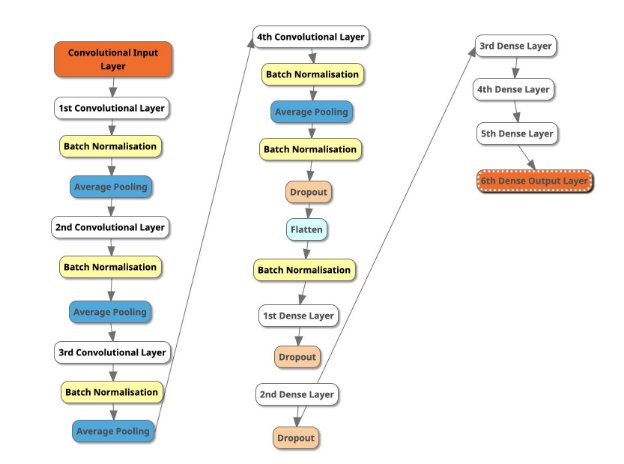
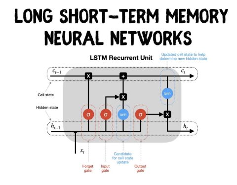
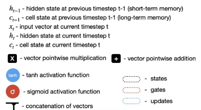
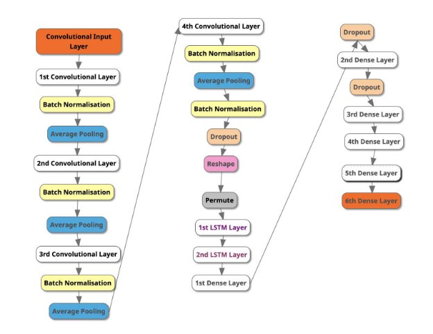
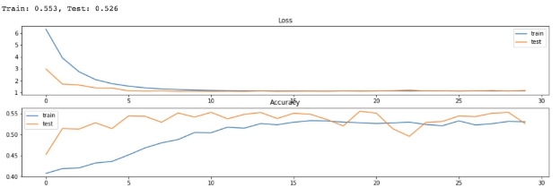
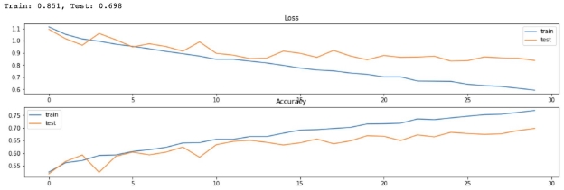

Problem Specification

Every day, Spotify uploads more than 60,000 songs, meaning every 1.4 seconds, a song is released on Spotify [(Benitez, 2022)](https://www.zotero.org/google-docs/?FfppUW). Music releasers use genre as a predictor to recommend users new songs, and such genre song classification is an essential task for such recommendation machines. However, audio data is complex, and many audio features/hidden correlations could classify song genres.

To solve this classification problem, I will create a hybrid convolutional neural network-long short-term memory (CNN-LSTM) network that classifies music genres. I will compare this with the baseline model of CNN to see whether adding LSTM aids in classification accuracy. The subset in this analysis contains four genres (Pop, Electronic, Rock, Folk), each with 500 tracks.

Data pre-processing

I will be using the FMA dataset [(Defferrard, 2016/2022)](https://www.zotero.org/google-docs/?MI66os), which has more than 100,000 audio tracks available with its metadata. The FMA dataset is chosen because it provides sufficient metadata that is easily accessible and has a diverse amount of categories compared to the standard GTZAN dataset.

I have decided to balance the dataset into the eight genres available. This is to prevent the model from being biased toward a specific genre. Uncorrupted and longer audio tracks are prioritised to generate an audio dataset of 8000 tracks.

Unfortunately, it takes a long time to run, so I shortened the dataset into four genres (Pop, Electronic, Folk and Rock) with 500 tracks each. Each track is divided into five segments of MFCC for this analysis for efficiency [(Velardo, 2019/2022)](https://www.zotero.org/google-docs/?Y4En7l).

MFCC is chosen as feature extraction. MFCC stands for Mel frequency coefficient cepstral coefficients, a small group of features that explain the spectral shape.

MFCC helps with music information retrieval, which reduces audio signal into a manageable set of values on the Mel frequency that quantises all the frequencies at each specific point in time of the audio. This is used over other features because the Mel scale considers how humans percept a frequency and is more effective than amplitude representation.

Solution specification

**Convolutional Neural Network (CNN)**

CNN is used as our neural network classification model's base model. CNN is used because it is efficient in classifying objects with spatial relations. In this scenario, audio is processed into spectrograms and is represented as MFCC with time and frequency. This makes it suitable to use a CNN model to predict genres [(Doshi, 2021)](https://www.zotero.org/google-docs/?ods3Kh).

CNN is made up of 3 layers: Convolution, pooling and connecting.

In the first layer, filters collect information about the features and move along the input to extract features from a group. These features reduce the number of input nodes and take advantage of the correlations observed. In the pooling layer, striding is done to reduce the number of dimensions to reduce overfitting and computational power when we do max pooling. We then push it into a fully-connected layer and use a softmax activation function to get the probabilities of the input being in a particular class [(Mendes, 2020)](https://www.zotero.org/google-docs/?LYV7Pn).

Our CNN model comprises 24 layers that have a convolution layer with an input size of 128 and a kernel of 3. There are four repeated convolution layers with an input size of (64-128-256-512), batch normalisation layer, average pooling 1-dimensional layer, flatten layer, dropout layer, and dense layers with ReLU and Softmax activation [(Mendes, 2020; Shukla, 2021)](https://www.zotero.org/google-docs/?ijTkSH). This is visualised by the figure below.

**Long Short-Term Memory (LSTM)**

LSTM is helpful because audio data is sequential, and data points occur one after another. An LSTM model solves the exploding gradient problem in RNN by incorporating short-term and long-term memory into the model. It implements various gates to determine what information to keep or discard. In a Recurrent Neural Network, we saw how we use a feedback loop to unroll a network that works well with sequential data, regardless of length [(Dobilas, 2022)](https://www.zotero.org/google-docs/?gWfE6T).

However, when we perform the math, we know there could be an exploding/vanishing gradient problem when the weight > 1 or < 1. If we have N amount of data points, and the weight = 2, the gradient would increase by 2^N times, and we take giant steps and overshoot gradient descent.

LSTM use two separate paths to make predictions. One for long-term (cell state) and the other for short-term memories (hidden state). In long-term memory, no weights and biases modify themselves directly, preventing the gradient from exploding or vanishing [(Gers et al., 2000)](https://www.zotero.org/google-docs/?LRQTWz).

*Figure 1: Long Short-term memory neural network visualisation [(Dobilas, 2022)*](https://www.zotero.org/google-docs/?jycWvi)*

The process can be broken down into five main steps:

1. Forget Gate: This gate decides how much information to forget. We use two forward-pass calculations for the hidden state and input vector by multiplying them with individual weights and added bias. This is then passed through a sigmoid function to create a number between 0 and 1.

a. Forget Gate Equation: = σ ( +  ℎ + )

−1

2. Input Gate: This gate decides on current input elements to add to the cell state. This is processed in two forward-pass calculations. One passes through the sigmoid function to calculate how much input information to add, and the other passes through the tanh function to decide the necessary information. The two are then multiplied together.
1. Input Gate (how much) Equation: = σ ( +  ℎ + )

−1

2. Input Gate (what) Equation: = ℎ ( +  ℎ + )

−1

3. Update cell state: Multiply the results of forget gate with the cell state to decide how much proportion of the cell state to remember. Then add new information from input gate to get the new cell state.

a. New Cell State Equation: =  × +  ×

−1 

4. Update hidden state: Update hidden state by passing cell state with tanh function and multiply with results of output gate (passed through a sigmoid function)
1. Output Gate Equation: = σ ( +  ℎ + )

−1

2. New Hidden State Equation: ℎ = σ ( )  × +  × −1 

In our CNN-LSTM model, it is implemented in a way where the features are first extracted using the CNN layers and the sequence prediction will be carried out by the LSTM layers. The CNN-LSTM model consists of 28 layers, with 24 layers identical to the CNN model. There are 2 additional LSTM layers with 128 neurons each. There is an addition of reshape and permute layers added in between CNN and LSTM to ensure the dimensions are reduced to synchronise with the input LSTM layer. The outputs will then pass through 6 Dense layers with filters of (1024-256-64-32-8-4) to classify our input back into different classes. Each LSTM layer has 128 neurons with an input shape of (128,1) [(Mendes, 2020; Nandi, 2021)](https://www.zotero.org/google-docs/?xZJG3O).  This is visualised by the figure below.

Testing and Analysis

The code for this is attached in the appendix to this PDF. We trained both the CNN and CNN-LSTM models for 30 epochs and computed the loss, classification accuracy, precision, recall and F1 score for both models.

CNN model

CNN-LSTM model

We see that the CNN model has a lower training and testing accuracy than the CNN-LSTM model. The accuracy can increase gradually with an increase in epochs as the loss decreases. The CNN model does not improve that much after epoch 15, with training and testing accuracy staying between 0.50 and 0.55. Whereas CNN-LSTM model seems to have an increasing testing accuracy even after epoch 15 and could increase more after epoch 13

||**CNN**|**CNN-LSTM**|
| :- | - | - |
|**Accuracy**|0.525742|0.697858|
|**Precision**|0.518814|0.696304|
|**Recall**|0.525742|0.697858|
|**F1 Score**|0.508416|0.696915|
From the statistics above, it is seen that the CNN-LSTM model has the best classification accuracy for testing dataset comparing to CNN, along with Precision, Recall and F1 Score. Hence, the CNN-LSTM model is considered the best compared to its base model. CNN-LSTM improved from CNN [(Brownlee, 2022)](https://www.zotero.org/google-docs/?YmP6L3).

Obstacles

I originally planned to process all 8000 audios of 8 different genres for building this Neural Network. However, it requires a lot of computer processing time and the laptop used in this study requires more than 12 hours to process everything. I cut the number of audio to 2000, with 500 audio clips for four different genres, which would still take 2.5 hours.

To resolve this problem, I decided to break the problem down into two parts. I uploaded it onto google collab to use a GPU hardware accelerator for quicker processing. At the same time, I used a smaller subset of the processed audio (MFCC) to test the neural network.

References

[Benitez, C. (2022, May 13). *20 Spotify Statistics 2022: Usage, Revenue & More*. Tone Island.](https://www.zotero.org/google-docs/?3Iv7dW)

[https://toneisland.com/spotify-statistics/](https://www.zotero.org/google-docs/?3Iv7dW)

[Brownlee, J. (2022, August 18). How to Calculate Precision, Recall, F1, and More for Deep Learning](https://www.zotero.org/google-docs/?3Iv7dW)

[Models. *MachineLearningMastery.Com*. https://machinelearningmastery.com/how-to-calculate-precision-recall-f1-and-more-for-deep-lear ning-models/](https://www.zotero.org/google-docs/?3Iv7dW)

[Defferrard, M. (2022). *FMA: A Dataset For Music Analysis* \[Jupyter Notebook\].](https://www.zotero.org/google-docs/?3Iv7dW)

[https://github.com/mdeff/fma (Original work published 2016)](https://www.zotero.org/google-docs/?3Iv7dW)

[Dobilas, S. (2022, March 5). *LSTM Recurrent Neural Networks—How to Teach a Network to Remember*](https://www.zotero.org/google-docs/?3Iv7dW)

[*the Past*. Medium. https://towardsdatascience.com/lstm-recurrent-neural-networks-how-to-teach-a-network-to-reme mber-the-past-55e54c2ff22e](https://www.zotero.org/google-docs/?3Iv7dW)

[Doshi, K. (2021, May 21). *Audio Deep Learning Made Simple: Sound Classification, step-by-step*.](https://www.zotero.org/google-docs/?3Iv7dW)

[Medium. https://towardsdatascience.com/audio-deep-learning-made-simple-sound-classification-step-by-st ep-cebc936bbe5](https://www.zotero.org/google-docs/?3Iv7dW)

[Gers, F. A., Schmidhuber, J., & Cummins, F. (2000). Learning to Forget: Continual Prediction with](https://www.zotero.org/google-docs/?3Iv7dW)

[LSTM. *Neural Computation*, *12*(10), 2451–2471. https://doi.org/10.1162/089976600300015015 Mendes, J. (2020). *Deep Learning Techniques for Music Genre Classification and Building a Music*](https://www.zotero.org/google-docs/?3Iv7dW)

[*Recommendation System*.](https://www.zotero.org/google-docs/?3Iv7dW)

[Nandi, P. (2021, March 1). *Recurrent Neural Nets for Audio Classification*. Medium.](https://www.zotero.org/google-docs/?3Iv7dW)

[https://towardsdatascience.com/recurrent-neural-nets-for-audio-classification-81cb62327990 Shukla, Y. (2021, December 28). Genre Classification using CNN. *Medium*.](https://www.zotero.org/google-docs/?3Iv7dW)

[https://medium.com/@yashi4001/genre-classification-using-cnn-dcbc109b6d1d](https://www.zotero.org/google-docs/?3Iv7dW)

[Velardo, V. (2022). *Musikalkemist/DeepLearningForAudioWithPython* \[Python\].](https://www.zotero.org/google-docs/?3Iv7dW)

[https://github.com/musikalkemist/DeepLearningForAudioWithPython/blob/44a0e1880eee57a523 780a1862cb8bf44963fbe8/12-%20Music%20genre%20classification:%20Preparing%20the%20d ataset/code/extract_data.py (Original work published 2019)](https://www.zotero.org/google-docs/?3Iv7dW)
